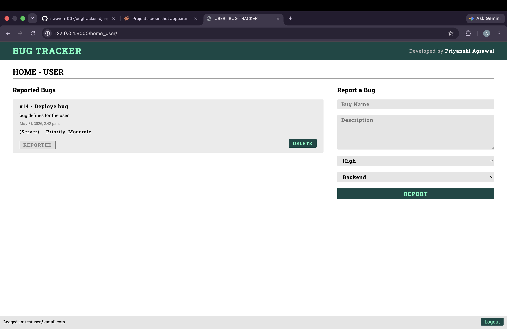
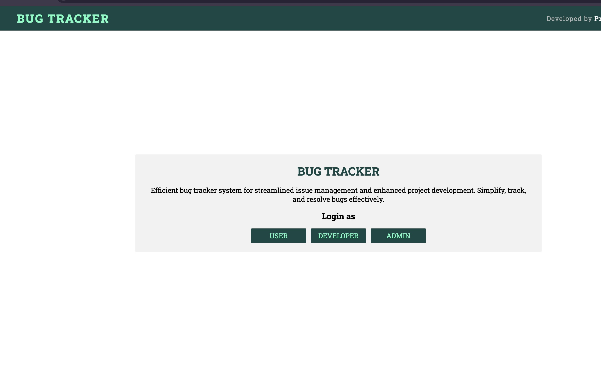
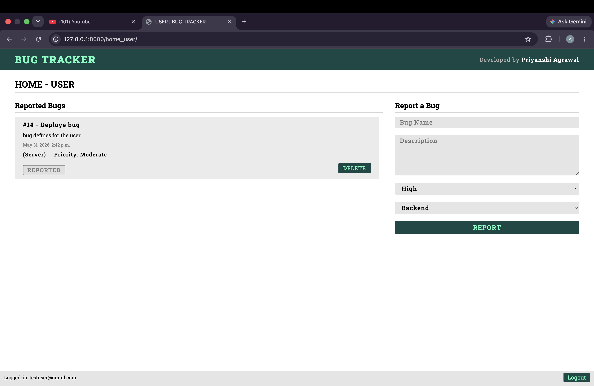

Project Interface.




# 🐞 Bug Tracker System
A complete role-based Bug Tracking System built using Django that helps users report bugs, admins manage and assign issues, and developers resolve them efficiently. The project follows a real-world software issue management workflow and demonstrates backend development, role-based authentication, CRUD operations, session management, and database handling using Django.                                                        # 🚀 Features
- 👤 User Authentication System
- 📝 Report Bugs with Priority & Category    
- 🧑‍💼 Admin Dashboard for Bug Management
- 👨‍💻 Developer Dashboard for Bug Resolution
- 📌 Bug Assignment Workflow
- 🔄 Bug Status Management
- 🗂 Category & Priority Management
- 🔐 Session-Based Authentication
- 💻 Clean and Responsive UI

# 🧩 Roles & Functionalities

## 👤 USER

Users can:

- Report new bugs
- Add bug descriptions
- Select bug priority
- Select bug category
- View reported bugs
- Delete bug reports
- Reopen resolved issues
- Track issue status

---

## 🧑‍💼 ADMIN

Admins can:

- View all reported bugs
- Monitor unresolved issues
- Assign bugs to developers
- Manage issue workflow
- Track project progress

---

## 👨‍💻 DEVELOPER

Developers can:

- View assigned bugs
- Resolve issues
- Reject invalid bug reports
- Update bug statuses

---

# 🔄 Bug Workflow

```text
User Reports Bug
        ↓
Admin Reviews Issue
        ↓
Bug Assigned to Developer
        ↓
Developer Resolves / Rejects
        ↓
User Verifies the Fix
```

---

# 🛠 Tech Stack

## Backend
- Django
- Python

## Frontend
- HTML5
- CSS3
- JavaScript

## Database
- SQLite3

---

# 📂 Project Structure

```bash
Bug-Tracker-Django/
│
├── bug_tracker/
│   ├── settings.py
│   ├── urls.py
│   ├── asgi.py
│   └── wsgi.py
│
├── main/
│   ├── migrations/
│   ├── static/
│   ├── templates/
│   ├── models.py
│   ├── views.py
│   ├── urls.py
│   └── admin.py
│
├── db.sqlite3
├── manage.py
├── requirements.txt
└── README.md
```

---

# ⚙️ Installation & Setup

## Clone Repository

```bash
git clone https://github.com/your-username/Bug-Tracker-Django.git
```

## Navigate to Project

```bash
cd Bug-Tracker-Django
```

## Create Virtual Environment

```bash
python3 -m venv venv
```

## Activate Virtual Environment

### macOS/Linux

```bash
source venv/bin/activate
```

### Windows

```bash
venv\Scripts\activate
```

## Install Dependencies

```bash
pip install -r requirements.txt
```

## Run Migrations

```bash
python manage.py migrate
```

## Start Development Server

```bash
python manage.py runserver
```

---

# 🌐 Open Project

```text
http://127.0.0.1:8000
```

---

# 🔑 Demo Credentials

## 👤 User

```text
Email: testuser@gmail.com
Password: Test12345
```

## 👨‍💻 Developer

```text
Email: developer@gmail.com
Password: Dev12345
```

## 🧑‍💼 Admin

```text
Email: admin@gmail.com
Password: Admin12345
```

---

# 🎯 Learning Outcomes

This project demonstrates:

- Django Fundamentals
- CRUD Operations
- Session Management
- Role-Based Authentication
- Database Relationships
- Backend Development
- Real-world Bug Management Workflow

---

# 🚀 Future Improvements

- JWT Authentication
- Email Notifications
- File Upload Support
- Dashboard Analytics
- Search & Filters
- REST API Integration
- Real-Time Notifications

---

# 👩‍💻 Developed By

Priyanshi Agrawal

⭐ If you like this project, give it a star on GitHub!
